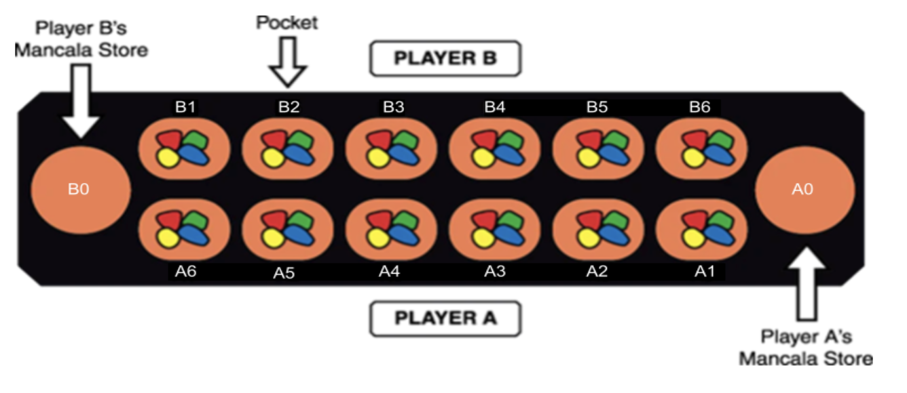

# CISC/CMPE 204 Modelling Project - Amy Brons, Alan Teng, Kate Edgar, Dan Munteanu

## Summary

Mancala is a two person ancient boardgame in which players strategically ‘sow’ and ‘capture’ game pieces called 'seeds'. The objective of the game is to get a higher score by strategically manipulating seeds around the board, which is made up of 12 'pits' (six per side) and two 'stores' (larger pockets at the end of each board, one per player). At the start of the game, each pit has four seeds. Once it has been decided who goes first, that player picks up all the pieces from one of the pockets on their side of the board, and deposits one seed in each of the preceeding pockets to the right, until they have no more pieces left in their hand. If the player’s last deposit lands in their store, they get another turn; This is called 'banking'. Once a seed has been banked, it cannot be moved from the store and seeds cannot be deposited in the opponent’s store. Similarly, if the player’s last seed lands in an empty pit on their side of the board, they claim all the pieces in pit directly opposite theirs. The game ends when either of the players has six empty pits on their side. The player with the most seeds in their respective store wins. 

For our project, we will be modelling the optimal next move for player A, given a randomized board state. 

See board visualization here:

## Structure

### General or Provided

* `documents`: Contains folders for both draft and final submissions. README.md files are included in both.
* `run.py`: General wrapper script containing propositions and constraints
* `test.py`: File to confirm that our submission has everything required

### Custom Code
* `board.py`: Gathers user input to create board state
* `resolver.py`: Simulates all possible moves in one round of the provided game
